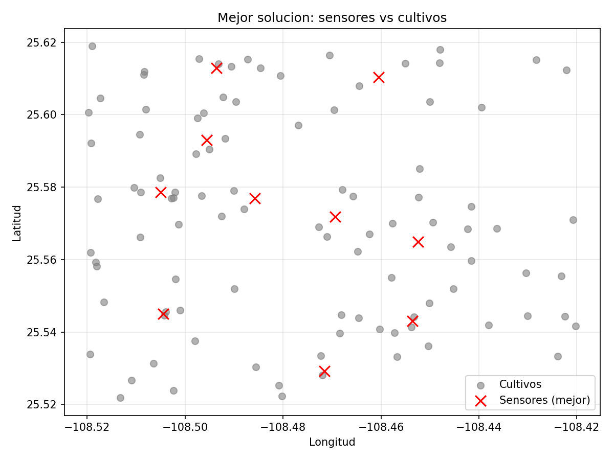
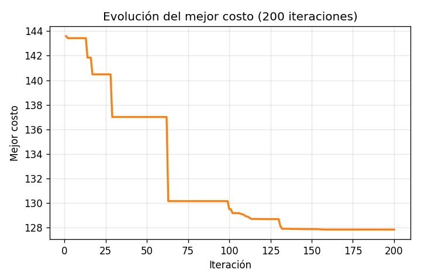
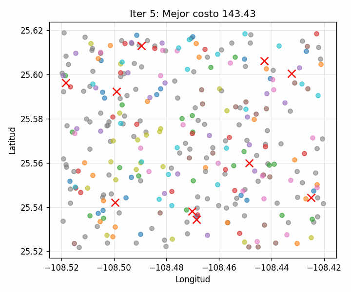

# PSO - Optimización sensores

**Descripción**: optimizador basado en PSO/Particle Swarm Optimization (PySwarms) que ubica sensores para cubrir cultivos.

## Estructura principal (dentro de `PSO/`)

- `main.py`: flujo principal. Carga `data/cultivos.csv`, configuración PSO y ejecución de la optimización.
- `funcion.py`: cálculo de distancias y función objetivo.
- `plots.py`: genera `best_solution_plot.png`, `frame_evolution_cost.png`, frames y `evolution.gif`.
- `data/`: datos de entrada (csv con datos de cultivos).
- `output/`: archivos de salida.

## Requisitos

Se recomienda usar Python 3.12.0+ y los paquetes listados en `requirements.txt`.

## Instalación rápida (PowerShell)

### Instalar dependencias

```powershell
cd PSO
python -m pip install -r requirements.txt
```

## Ejemplo de uso

1. Ejecutar el flujo principal (genera solución y archivos de salida):

```powershell
python main.py
```

## Salida esperada

- Archivos HTML con mapas en `output/`:
  - `best_solution_plot.png` — mapa con cultivos y ubicación de sensores para la mejor solución.
  - `frame_evolution_cost.png` — Curva con la evolución del mejor costo a lo largo de las iteraciones.
  - `best_solution.txt` — archivo txt con las coordenadas de los sensores de la mejor solución.
  - `evolution.gif` — GIF de la evolución de la posición de las particulas en cada N iteraciones.
- Mensajes en consola con estadísticas del costo de la solución inicial y costo de la mejor solución.

### Ejemplo de archivos generados

|                                               Mapa inicial | Asignaciones                                                 |
| ---------------------------------------------------------: | :----------------------------------------------------------- |
|  |  |

| GIF Evolución PSO |
| ----------------- |

  

## Consejos y notas

- Ajustar parámetros del PSO en `main.py` (`w`, `c1`, `c2`, `w_decay`, `iters`) según como desee favorecer la convergencia.
- Modificar en los frames deseados para el GIF `main.py`(`frame_every`)
